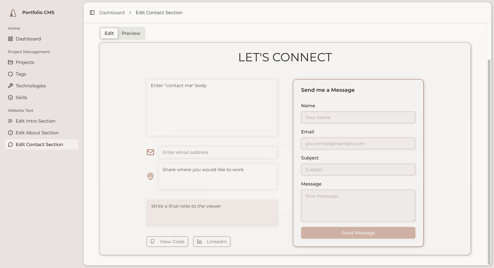
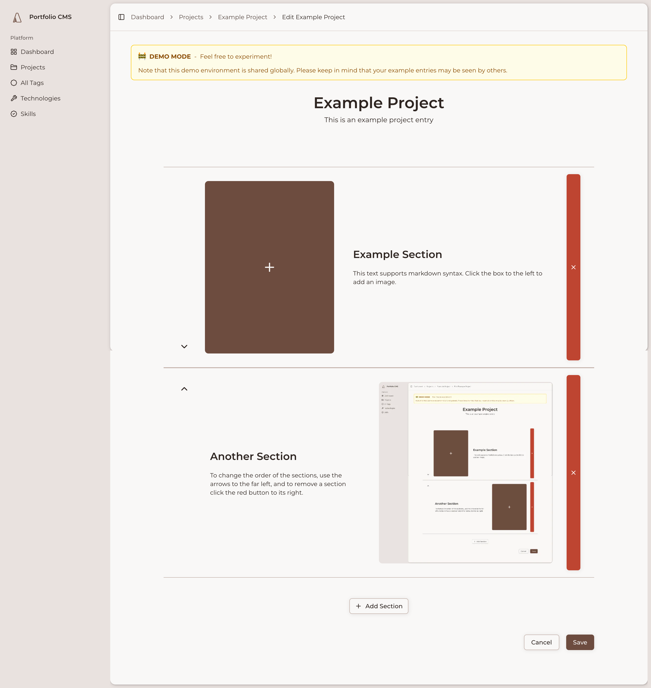

# Personal Portfolio & CMS

A full-stack web application combining a public-facing portfolio site with a comprehensive content management system for managing projects, technologies, and skills. Built to showcase full-stack development capabilities while providing an intuitive admin interface for content management.

## Demo

**Live Sites:**

- Portfolio: [annikaharmsen.com](https://annikaharmsen.com)
- Demo Admin (public): [admin-demo.annikaharmsen.com](https://admin-demo.annikaharmsen.com)

**Screenshots:**




## Installation

### Prerequisites

- PHP 8.2+
- Composer
- Node.js 18+
- MySQL (or SQLite for local testing)

### Setup

```bash
# Clone the repository
git clone https://github.com/yourusername/portfolio.git
cd portfolio

# Install PHP dependencies
composer install

# Install JavaScript dependencies
npm install

# Set up environment
cp .env.example .env
php artisan key:generate

# Configure database in .env file
# For local development, SQLite is supported
# For production, configure MySQL credentials

# Run migrations
php artisan migrate

# Create an admin user
php artisan create:admin-user

# Build frontend assets
npm run build
```

## Usage

### Development

```bash
# Start Laravel development server
php artisan serve

# In a separate terminal, start Vite dev server
npm run dev
```

Visit `http://localhost:8000` for the public portfolio site.

### Accessing the Admin Panel

Navigate to `/admin` and log in with the credentials created during setup. The admin panel provides:

- Full CRUD operations for projects with bulk actions
- Tag management with category filtering (frontend, backend, tools, skills)
- Featured project toggles
- Project metadata management (icons, links, dates, descriptions)
- Image management for hero sections

### Running Tests

```bash
# PHP tests
php artisan test

# JavaScript tests (Jest)
npm test
```

## Features

- **Project Management**: Full CRUD with bulk operations, featured toggles, and rich metadata
- **Tag System**: Unified tag management with category-based filtering for technologies and skills
- **Admin Dashboard**: Intuitive interface with breadcrumb navigation and form validation
- **Public Portfolio**: Responsive portfolio page displaying projects and technical skills by category
- **Demo Environment**: Public-facing demo admin panel showcasing CMS capabilities
- **Image Management**: Upload and manage images for project hero sections
- **Many-to-Many Relationships**: Flexible project-tag associations
- **Type Safety**: Auto-generated TypeScript types from Laravel models using Model Typer
- **Modern UI**: Built with shadcn/ui components and Tailwind CSS
- **Secure Authentication**: Protected admin routes with email verification

## Tech Stack

**Frontend**

- React 19 with TypeScript
- Inertia.js (SPA experience with server-side routing)
- Vite (build tool)
- Tailwind CSS 4
- shadcn/ui components
- Lucide React (icons)
- Redux Toolkit (state management)
- React Table (data tables)
- React Window (virtualization)

**Backend**

- Laravel 12 (PHP 8.2+)
- MySQL (SQLite for local testing)
- Laravel Pint (code formatting)
- Model Typer (auto-generate TypeScript types)

**Testing**

- PHPUnit (backend)
- Jest (frontend)

**Development Tools**

- Composer (PHP dependencies)
- npm (JavaScript dependencies)
- Artisan (Laravel CLI)

## Project Structure

```
/resources/js         # Frontend React application
  /components         # Reusable UI components
  /pages             # Page components (admin, auth, portfolio)
  /hooks             # Custom React hooks
  /types             # TypeScript definitions

/app                 # Laravel backend
  /Console/Commands  # Artisan commands (e.g., CreateAdminUser)
  /Enums            # Enum types (TagCategory, LucideIcon)
  /Http             # Controllers, Middleware, Request classes
  /Models           # Database models (Project, Tag, User)

/database/migrations # Database schema definitions
/routes             # Web, admin, and admin-demo routing
/tests              # PHPUnit test suite
```

## Admin Commands

### Create Admin User

Create a new admin user with interactive prompts:

```bash
php artisan create:admin-user
```

Or with parameters (avoid password parameter for security):

```bash
php artisan create:admin-user --name="Admin Name" --email="admin@example.com"
```

### Generate Icon Bundle

Regenerate the icon bundle (automatically triggered on project saves):

```bash
php artisan icons:generate
```

## Database Models

- **Project**: Stores project data (icon, title, subtitle, description, links, featured status, date)
- **Tag**: Unified model for technologies and skills with category enum (frontend, backend, tool, skill)
- **User**: Authentication with email verification
- **project_tags**: Pivot table for many-to-many project-tag relationships

## Admin Routes (Protected)

- `GET /admin` - Admin dashboard
- `GET /admin/projects` - Project index
- `POST /admin/projects` - Create project
- `GET /admin/projects/{project}` - View project
- `PUT /admin/projects/{project}` - Update project
- `DELETE /admin/projects/{project}` - Delete project
- `DELETE /admin/projects/bulk-delete` - Bulk delete projects
- `GET /admin/tags` - Tag management
- `GET /admin/technologies` - Technology filtering
- `GET /admin/skills` - Skills filtering

## Key Features in Detail

### Breadcrumb System

Dynamic breadcrumb navigation with hierarchical structure:

- Dashboard → Projects → Create Project
- Automatic parent-child relationships
- Clean API: `getBreadcrumbs('create_project')`

### Form Validation

Comprehensive validation system:

- Server-side validation with Laravel Form Requests
- Real-time error display in React components
- Automatic GitHub URL processing
- Required field validation with user-friendly messages

### Project Ordering

Intelligent project ordering:

- Featured projects displayed first
- Date-based secondary sorting (newest first)
- Implemented via Eloquent scopes for consistency

### Tag Category System

Unified tagging approach with category-based filtering:

- Single Tag model with category enum
- Separate admin UIs for technologies vs skills
- Reduces code duplication while maintaining UX flexibility

## License

This project is licensed under the MIT License - see the [LICENSE](LICENSE) file for details.

## About

Created as a personal portfolio site to showcase full-stack development skills and provide a flexible CMS for managing professional content. The project demonstrates modern web development practices including SPA architecture, type-safe development, and comprehensive testing.
